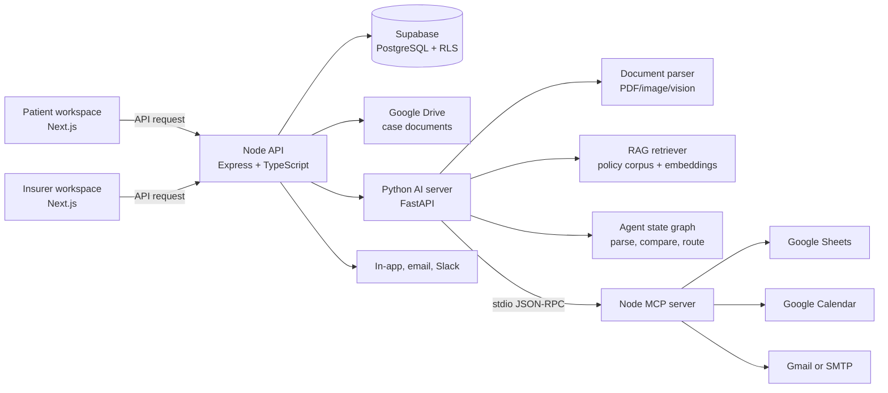
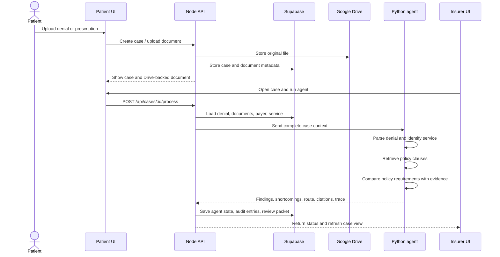
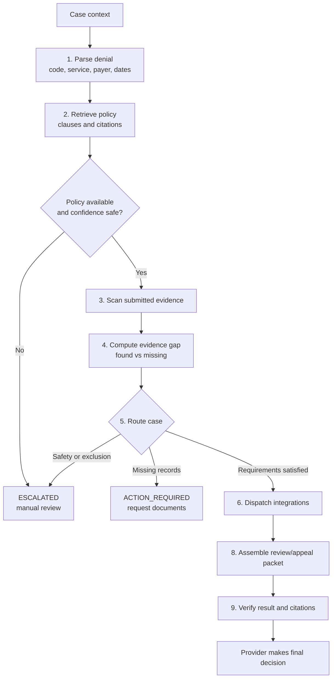
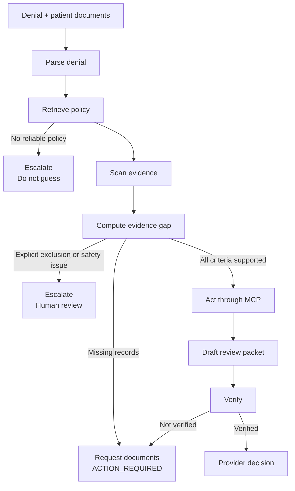
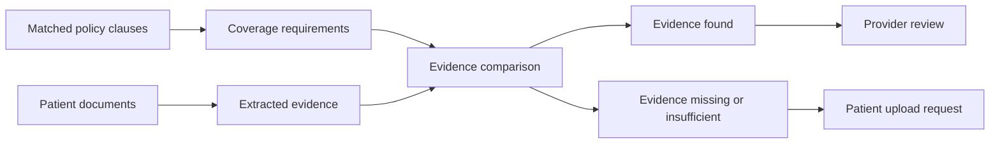
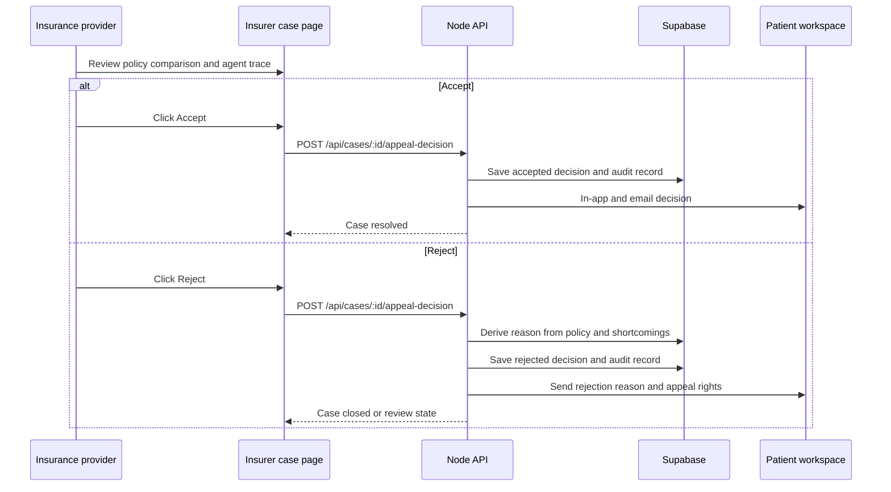
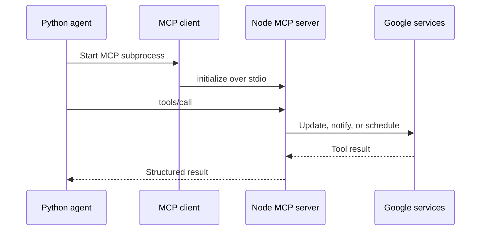
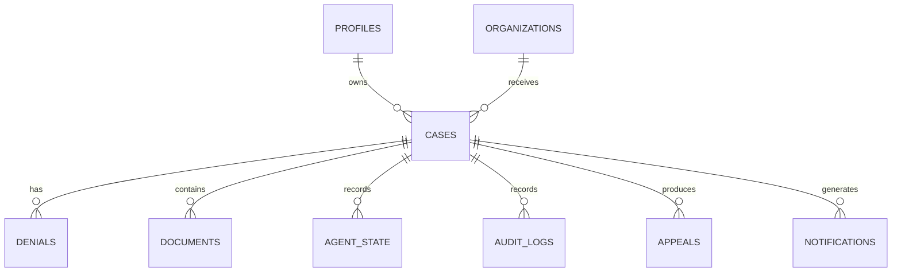

# Claimsure

Claimsure is a prototype workflow for insurance denial recovery. It connects a patient workspace, an insurance-provider workspace, a Node.js API, and a Python AI workflow.

The system is designed to:

- store denial and supporting documents in Google Drive;
- extract structured claim information;
- retrieve relevant payer policy clauses with RAG;
- compare policy requirements with submitted evidence;
- list evidence that was found and evidence that is missing;
- route cases to automated actions, patient follow-up, or human review;
- keep an auditable case timeline; and
- notify people and mirror case activity to connected services.

Claimsure is a prototype. It uses synthetic/demo data and must not be used as an autonomous medical, legal, or insurance decision-maker.

## Demo

YouTube demo: https://youtu.be/FE0DFMdbTYk

## Architecture



| Service | Location | Responsibility |
| --- | --- | --- |
| Client | `client/` | Patient and insurer workspaces, uploads, review controls, timelines |
| API server | `server/` | Auth, authorization, database records, Drive uploads, decisions, notifications |
| AI server | `ai-server/` | Parsing, policy retrieval, evidence comparison, routing, drafting |
| MCP server | `server/src/mcp/` | Exposes policy, case, notification, and Google tools over stdio |
| Database | Supabase | Cases, denials, documents, appeals, agent state, audit logs, notifications |

## End-to-End Claim Flow



## Agent Decision Flow



Possible case outcomes:

- `ACTION_REQUIRED`: patient or provider must supply missing records.
- `AWAITING_REVIEW`: evidence is ready for an insurer decision.
- `ESCALATED`: policy coverage is unavailable, contradictory, unsafe, or explicitly excluded.
- `APPEAL_READY`: a citation-backed review packet is available.
- `RESOLVED`: only after the insurer accepts the claim or appeal.

The AI prepares evidence and recommendations. It does not replace the insurer's final decision.

## Agent Catalog

The agent is a stateful workflow, not one unrestricted model call. Each node receives the current `CaseState`, adds structured findings, records a trace entry, and passes the state to the next node.

| # | Agent node | What it does | How it works | Output |
| --- | --- | --- | --- | --- |
| 1 | `parse_denial` | Reads the denial letter and identifies the denial code, payer, service, procedure code, and appeal deadline. | Uses deterministic patterns first, then a structured LLM response when live extraction is enabled. | Normalized denial and service fields |
| 2 | `retrieve_requirements` | Finds the policy clauses relevant to the payer, service, and denial reason. | Calls the RAG retriever, filters by payer/service metadata, and ranks policy chunks by similarity. | Policy requirements, citations, and confidence |
| 3 | `scan_evidence` | Inventories the patient documents attached to the case. | Reads document metadata and available extracted text; it does not invent evidence. | Evidence summaries and document trace |
| 4 | `compute_gap` | Compares policy requirements with the submitted evidence. | Uses deterministic evidence checks and service-specific clinical criteria where available. | `found_evidence` and `missing_evidence` |
| 5 | `route` | Decides what is safe to do next. | Applies safety boundaries, policy confidence checks, coverage exclusions, and missing-evidence rules. | `act`, `await_human`, or `abstain` |
| 6 | `act` | Performs allowed operational side effects. | Starts the MCP client and calls registered tools for Sheets, notifications, and Calendar when the case is eligible. | Dispatched actions and tool results |
| 7 | `await_human` | Pauses the workflow when a person or additional evidence is required. | Creates a trace explaining the pause and sets an action/review status. | Human-review status and reason |
| 8 | `assemble_appeal` | Prepares a review or appeal packet. | Combines policy citations, found evidence, and case details; live mode may use an LLM to draft the letter. | Citation-backed appeal text |
| 9 | `verify` | Checks that the final result still agrees with the evidence and safety state. | Re-runs the evidence-gap check and refuses verification when a safety escalation remains active. | `verified`, verification notes, and final workflow status |

### Agent behavior by situation



### What the agent does not do

- It does not treat the existence of a file as proof that the file satisfies policy.
- It does not approve a claim by itself; the insurer makes the final decision.
- It does not continue when policy retrieval is missing or below the confidence threshold.
- It does not hide missing evidence; those shortcomings are persisted and shown to the provider.
- It does not use MCP to decide coverage. MCP only provides controlled tools for side effects.

## Policy and Evidence Comparison



The insurer case page exposes **Policy vs. submitted evidence** with:

- matched policy clause count;
- evidence found count;
- shortcomings count;
- specific missing or unsatisfied requirements;
- supporting evidence; and
- expandable policy text and citations.

### Current policy source

The current RAG corpus is loaded from:

```text
ai-server/data/policies/
ai-server/data/embeddings.json
```

Policy chunks are filtered by payer and service code, then ranked by deterministic similarity. The repository does **not yet** include an organization-level insurer policy upload and indexing workflow. The current comparison therefore uses the configured local payer corpus, not a policy uploaded from the insurer UI.

## Provider Decision Flow



The rejection explanation is generated from the stored agent result. The provider is not required to type a second clinical justification.

## MCP and Google Services

MCP is the tool boundary used by the Python agent for side effects. It is not the policy engine and does not make the medical decision.



| Integration | Use |
| --- | --- |
| Google Drive | Stores original denial, prescription, and supporting documents |
| Google Sheets | Mirrors case status, service data, timestamps, and Drive URLs |
| Google Calendar | Creates review reminders and appeal/deadline events |
| Gmail or SMTP | Sends patient and provider updates and decision results |
| Slack | Sends provider approval and escalation alerts when configured |
| MCP | Gives the Python agent a standard interface to these actions |

The Python agent starts the Node MCP server over stdio when it reaches its action node. The subprocess must run from `server/` so it can load the server environment and Google configuration.

## Stored Case Data



- `cases`: patient, insurer organization, service, payer, and lifecycle status.
- `denials`: reason, raw text, code, deadline, and Drive file ID.
- `documents`: document metadata and Drive URL.
- `agent_state`: workflow result, policy clauses, findings, and actions.
- `audit_logs`: append-only agent and human activity.
- `appeals`: generated review packet and final appeal status.
- `notifications`: in-app, email, and Slack delivery records.

## Repository Layout

```text
Claimsure/
├── client/                    Next.js routes and workspaces
├── server/                    Express API, database, MCP, integrations
├── ai-server/                 FastAPI, agent graph, RAG, workflows
│   ├── app/agents/             State graph and agent nodes
│   ├── app/rag/                Chunking, embeddings, retrieval
│   ├── app/services/            Parsing and service helpers
│   ├── data/policies/           Current local policy corpus
│   └── eval/                   Evaluation harness and metrics
├── architecture_flow.md       Architecture notes
└── README.md
```

## Local Development

### Prerequisites

- Node.js and pnpm
- Python 3.9+
- Supabase project and keys
- Google OAuth or service-account configuration
- Optional Gemini/Groq credentials for live extraction and drafting

### Start the client

```bash
cd client
pnpm install
pnpm dev
```

Client: `http://localhost:3000`

### Start the API server

```bash
cd server
pnpm install
pnpm dev
```

API: `http://localhost:5001`

Run these files in Supabase SQL Editor:

1. `server/src/database/schema.sql`
2. `server/src/database/seed.sql` for demo data

### Start the AI server

```bash
cd ai-server
python3 -m venv venv
source venv/bin/activate
pip install -r requirements.txt
uvicorn app.main:app --reload --port 8000
```

AI server: `http://localhost:8000`

```bash
curl http://localhost:8000/health
curl http://localhost:5001/health
```

### Run MCP directly

MCP uses stdio rather than an HTTP port:

```bash
cd server
pnpm exec tsx src/mcp/mcp-server.ts
```

For the Inspector:

```bash
cd server
pnpm dlx @modelcontextprotocol/inspector ./node_modules/.bin/tsx src/mcp/mcp-server.ts
```

The Inspector normally opens at `http://localhost:6274`.

The `policy_search` request path is:

```text
MCP Inspector
  -> server/src/mcp/tools/policy-search.ts
  -> GET http://localhost:8000/api/rag/search
  -> ai-server/app/rag/retriever.py
  -> ai-server/data/embeddings.json
```

Test it directly:

```bash
curl "http://localhost:8000/api/rag/search?q=prior%20authorization&payer_id=payer_a&service_code=CPT-72148"
```

Use synthetic data and `DRY_RUN=true` while testing email, calendar, Sheets, Slack, or MCP actions.

## Reliability and Safety

- Pydantic schemas validate structured AI output.
- Evidence comparison and routing use deterministic rules where practical.
- Policy citations reduce unsupported recommendations.
- Role and organization checks protect case access.
- Idempotency keys protect agent-triggering requests.
- Append-only audit logs record agent and human actions.
- Safety, exclusion, missing-policy, and missing-evidence cases stop or escalate rather than auto-approve.

## Testing and Evaluation

```bash
cd ai-server
python -m eval.harness
```

The evaluation harness covers routing, evidence gaps, citation validity, safety escalation, and unsupported-claim behavior. API examples are in `server/docs/` and `docs/`.

## Screenshots

### Application Screens


### Google Mail and Calendar


## Project Status

The prototype includes patient and insurer workspaces, Drive-backed documents, local policy RAG, evidence-gap display, agent traces, provider decisions, notifications, Google integrations, and MCP tooling.

The main planned capability is organization-scoped insurer policy management: upload a policy, associate it with an insurer and payer, index it, version it, and use it as the authoritative corpus for future comparisons.

## Disclaimer

Claimsure is a prototype for demonstration and educational purposes. It uses synthetic or demo data and is not a replacement for professional medical, legal, insurance, or underwriting judgment.