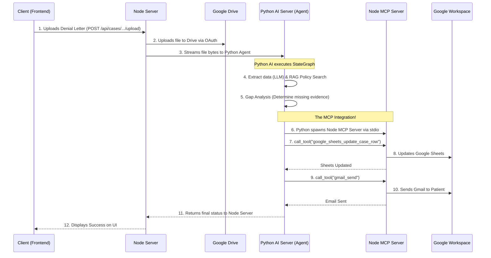

# Claimsure Updated Architecture & Workflow Guide

This document breaks down the fully integrated Claimsure platform, specifically highlighting how the **React Client**, **Node Server**, **Python AI Server**, and **MCP (Model Context Protocol)** work together as a cohesive unit.

---

## 1. The Architecture Overview

The application is a distributed microservice ecosystem:

1. **Client (Frontend)**: The React/Next.js UI where users upload denial letters.
2. **Server (Node.js)**: The central orchestrator. It handles authentication, database (Supabase) records, and Google Drive uploads. It also hosts the **MCP Server**, which wraps Google Sheets, Gmail, and Calendar into AI-accessible tools.
3. **AI-Server (Python)**: The autonomous Medical AI Agent. It uses RAG for policy retrieval, executes a deterministic gap analysis, and now acts as an **MCP Client** to execute side effects directly.

---

## 2. The Step-by-Step Integrated Flow

When a user interacts with the app, the system follows this highly agentic workflow:

### Why this architecture is incredible for the Hackathon
The Python Agent is not just returning a JSON string for the Node server to blindly execute. The Python Agent **literally connects to the Node MCP Server and fires the tools autonomously**. This demonstrates true AI agency using industry-standard protocols.

---

## 3. Example Clinical Cases

Here is how the Agent behaves in two different real-world scenarios.

### Example Case 1: The Automated Success (Knee MRI)
* **The Scenario:** A patient's MRI of the Knee (CPT-73721) is denied by UnitedHealthcare for "lack of medical necessity." The patient uploads the denial letter along with their doctor's physical therapy notes and an X-ray report.
* **The Flow:**
  1. **Client:** Patient uploads the documents.
  2. **Node Server:** Uploads them to Google Drive and passes them to the AI Server.
  3. **Python AI (Parse & RAG):** Reads the denial, identifies CPT-73721. Pulls the UHC policy which requires "4 weeks of conservative therapy" and a "prior X-ray".
  4. **Python AI (Gap Analysis):** Scans the uploaded documents. It finds the PT notes (proving 4 weeks therapy) and the X-ray report. It concludes there is **no missing evidence**.
  5. **Python AI (Draft):** Uses Gemini to instantly draft a formal 2-page appeal letter citing the specific UHC policy clauses.
  6. **Python AI (MCP Act):** Connects to the MCP server.
     - Calls `google_sheets_update_case_row` to set status to `APPEAL_READY`.
     - Calls `google_calendar_create_event` to set the filing deadline.
     - Calls `gmail_send` to email the patient: *"Your appeal has been successfully generated and is ready to file."*
  7. **Result:** A 15-day manual appeals process completed autonomously in 10 seconds.

### Example Case 2: The Missing Evidence (Lumbar MRI)
* **The Scenario:** A patient's MRI of the Lumbar Spine (CPT-72148) is denied. The patient uploads the denial letter, but **forgets** to upload their physical therapy notes.
* **The Flow:**
  1. **Client & Server:** Handles upload to Drive and passes to AI Server.
  2. **Python AI (Parse & RAG):** Identifies CPT-72148. Pulls policy requiring "6 weeks conservative therapy".
  3. **Python AI (Gap Analysis):** Scans uploaded evidence. It **fails** to find any mention of physical therapy.
  4. **Python AI (Route):** The Agent hits a safety boundary. It realizes it cannot win this appeal without the PT notes. It routes to the `await_human` node.
  5. **Python AI (MCP Act):** Connects to the MCP server.
     - Calls `google_sheets_update_case_row` to set status to `ACTION_REQUIRED`.
     - Calls `gmail_send` to email the patient: *"We cannot file your appeal yet. Based on the insurer's policy, we need you to upload your 6-week physical therapy notes."*
  6. **Result:** The AI Agent prevents an unwinnable appeal from being filed and autonomously follows up with the patient to gather the exact missing medical evidence.
