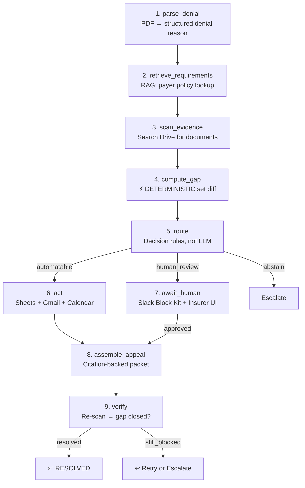

# 🩺 Claimsure — Hackathon Implementation Plan (v3)

**AI Prior Authorization & Denial Recovery Agent**
**Multi-App AI Agent Hackathon · Sunday, September 13, 2026 · 9:30 AM – 4:00 PM PT**

---

## Hackathon Requirements (Confirmed from website)

| Requirement      | Detail                                                                                          |
| ---------------- | ----------------------------------------------------------------------------------------------- |
| **Brief**        | Build one useful, multi-step AI agent. Connect to ≥3 external apps. Show how you know it works. |
| **Submit**       | Working repo + 2-minute demo + System & reliability brief                                       |
| **Team**         | 1–4 people (your team: 3 people)                                                                |
| **Build window** | 6.5 hours (9:30 AM – 4:00 PM PT)                                                                |
| **Prizes**       | $10,000 / $4,000 / $1,000 + guaranteed interviews                                               |

| Weight  | Criterion                | What We Target                                                                                  |
| ------- | ------------------------ | ----------------------------------------------------------------------------------------------- |
| **30%** | Technical execution      | Real multi-step agent with MCP server, state machine, typed tools, proper auth + RBAC           |
| **25%** | Reliability & evaluation | 20-case eval harness with metrics table, DRY_RUN, audit log                                     |
| **20%** | Usefulness               | End-to-end denial→appeal workflow with role-based dashboards for patients & insurance providers |
| **15%** | Originality              | Verify loop (agent checks its own work), code-enforced safety constraints, org-tenancy          |
| **10%** | Demo clarity             | Pre-recorded 2-min demo, scripted, one rehearsal                                                |

---

## Revised System Architecture (2 Roles)

```text
                         ┌───────────────────────────────────┐
                         │              CLIENT               │
                         │        Next.js + Tailwind         │
                         │                                   │
                         │   ┌──────────────┬────────────┐   │
                         │   │ Patient View │ Insurer UI │   │
                         │   │ (Status/Docs)│ (Ops & AI) │   │
                         │   └──────────────┴────────────┘   │
                         └─────────────────┬─────────────────┘
                                           │
                         ┌─────────────────▼─────────────────┐
                         │             BACKEND               │
                         │      Express + TypeScript         │
                         │                                   │
                         │  Auth · 2-Role RBAC · API         │
                         │  Business Orchestration           │
                         │  Notifications Engine             │
                         └────────┬────────┬────────┬────────┘
                                  │        │        │
                 ┌────────────────┘        │        └────────────────┐
                 │                         │                         │
          ┌──────▼──────┐           ┌──────▼──────┐           ┌──────▼──────┐
          │  Supabase   │           │  AI Server  │           │ MCP Server  │
          │  PostgreSQL │           │ Python/Fast │           │  TS/Express │
          │             │           │             │           │             │
          │ Users (2)   │           │ 🧠 Agents   │           │ Tools:      │
          │ Orgs        │           │ 📚 RAG      │           │ • Drive     │
          │ Cases       │           │ 🔄 Workflow │           │ • Gmail     │
          │ Documents   │           │ 📊 Eval     │           │ • Sheets    │
          │ Audit Logs  │           └─────────────┘           │ • Slack     │
          │ Notifs      │                                     │ • Calendar  │
          └─────────────┘                                     └─────────────┘
```

> [!IMPORTANT]
> **Role Scoping**: Exactly **2 roles** throughout the entire system:
>
> 1. `patient` (individual submitting claims/evidence, tracking status, receiving notifications)
> 2. `insurance_provider` (payer/claims operations managing cases, triggering AI agent analysis, reviewing & approving appeals/determinations)

---

## Your Existing Repo Structure

```text
Claimsure/
├── client/          → Next.js 16 + Tailwind 4 + TypeScript     (SCAFFOLDED, empty)
├── server/          → Express 5 + TypeScript                    (SCAFFOLDED, empty)
├── ai-server/       → FastAPI + Python + Pydantic               (SCAFFOLDED, empty)
│   ├── app/
│   │   ├── main.py         ✅ Hello-world endpoint exists
│   │   ├── agents/         📁 Empty
│   │   ├── rag/            📁 Empty
│   │   ├── workflows/      📁 Empty
│   │   ├── mcp/            📁 Empty
│   │   └── services/       📁 Empty
│   ├── data/               📁 Empty
│   └── eval/               📁 Empty
└── README.md        ✅ Complete architecture doc
```

---

## 1. Auth System

### Provider: **Supabase Auth**

Supabase Auth handles OAuth, email/password, session tokens, password reset, and email verification out of the box — zero custom auth code needed.

| Feature                | Implementation                                                                                         |
| ---------------------- | ------------------------------------------------------------------------------------------------------ |
| **Google OAuth**       | Supabase Auth → Google provider (single config toggle)                                                 |
| **Email/Password**     | Supabase Auth built-in → `supabase.auth.signUp()` / `signInWithPassword()`                             |
| **Session management** | Supabase JWT tokens → passed in `Authorization` header → Express validates via `@supabase/supabase-js` |
| **Password reset**     | `supabase.auth.resetPasswordForEmail()` → built-in email flow                                          |
| **Email verification** | Supabase Auth setting → auto-sends verification email                                                  |

### Auth Flow

```text
Client                     Express Backend              Supabase Auth
  │                              │                           │
  ├─ signUp/signIn ─────────────────────────────────────────►│
  │◄────────────────── JWT token ────────────────────────────┤
  │                              │                           │
  ├─ API request + JWT ─────────►│                           │
  │                              ├─ verify JWT ─────────────►│
  │                              │◄─ user + role ────────────┤
  │                              ├─ check 2-role RBAC        │
  │                              ├─ execute                  │
  │◄────── response ────────────┤                           │
```

---

## 2. RBAC — Role-Based Access Control (2 Roles Only)

### Roles

```text
Roles (Strictly 2)
├── patient
│   └── View personal cases, documents, and real-time status
│   └── Upload required missing clinical records/evidence
│   └── Receive in-app notifications and email updates
│
└── insurance_provider
    └── View all claims/cases assigned to their organization
    └── Trigger 9-node AI agent for prior-auth / denial analysis
    └── Approve, reject, or override AI recommendations & appeal drafts
    └── Review audit trails and access the 20-case evaluation harness
    └── Update claim determination / appeal status
```

### Permission Matrix

| Resource / Action                    | Patient            | Insurance Provider          |
| ------------------------------------ | ------------------ | --------------------------- |
| View own cases / claims              | ✅ (personal only) | ✅ (all org-assigned cases) |
| View other users' cases              | ❌                 | ❌ (cross-org blocked)      |
| Trigger AI Agent analysis            | ❌                 | ✅                          |
| Approve / reject AI recommendation   | ❌                 | ✅                          |
| Upload documents / evidence          | ✅ (own case)      | ✅ (assigned claims)        |
| View documents                       | ✅ (own case)      | ✅ (assigned claims)        |
| Update claim / appeal status         | ❌                 | ✅                          |
| View case audit trail                | ✅ (own case)      | ✅ (org cases)              |
| View AI evaluation metrics & harness | ❌                 | ✅                          |

> [!WARNING]
> **Backend must enforce permissions — not just hide UI.** Every Express route checks `req.user.role` (`patient` vs `insurance_provider`) and `req.user.organization_id` before returning data. Supabase Row Level Security (RLS) provides a second enforcement layer at the database level.

---

## 3. Database — Supabase / PostgreSQL

### Schema

```sql
-- Organizations (multi-tenancy for insurance payers)
CREATE TABLE organizations (
  id UUID PRIMARY KEY DEFAULT gen_random_uuid(),
  name TEXT NOT NULL,                         -- e.g. 'Aetna Health', 'BlueCross BlueShield'
  type TEXT NOT NULL DEFAULT 'insurance_provider' CHECK (type IN ('insurance_provider')),
  created_at TIMESTAMPTZ DEFAULT now()
);

-- User profiles (extends Supabase auth.users — 2 ROLES ONLY)
CREATE TABLE profiles (
  id UUID PRIMARY KEY REFERENCES auth.users(id),
  email TEXT NOT NULL,
  full_name TEXT NOT NULL,
  role TEXT NOT NULL CHECK (role IN ('patient', 'insurance_provider')),
  organization_id UUID REFERENCES organizations(id), -- NULL for patients, populated for insurance staff
  created_at TIMESTAMPTZ DEFAULT now()
);

-- Cases (central claim/prior-auth entity)
CREATE TABLE cases (
  id UUID PRIMARY KEY DEFAULT gen_random_uuid(),
  case_number TEXT UNIQUE NOT NULL,          -- e.g. R1007
  patient_id UUID REFERENCES profiles(id) NOT NULL,
  insurer_org_id UUID REFERENCES organizations(id) NOT NULL,
  service_type TEXT NOT NULL,                -- e.g. 'MRI Lumbar Spine'
  service_code TEXT,                         -- e.g. 'CPT-72148'
  payer_id TEXT,                             -- e.g. 'payer_a'
  status TEXT NOT NULL DEFAULT 'PENDING'
    CHECK (status IN (
      'PENDING', 'ANALYZING', 'ACTION_REQUIRED',
      'AWAITING_REVIEW', 'APPEAL_READY', 'SUBMITTED',
      'VERIFYING', 'RESOLVED', 'ESCALATED', 'CLOSED'
    )),
  created_at TIMESTAMPTZ DEFAULT now(),
  updated_at TIMESTAMPTZ DEFAULT now()
);

-- Denials
CREATE TABLE denials (
  id UUID PRIMARY KEY DEFAULT gen_random_uuid(),
  case_id UUID REFERENCES cases(id) NOT NULL,
  denial_code TEXT,
  denial_reason TEXT NOT NULL,
  denial_date DATE,
  appeal_deadline DATE,
  raw_text TEXT,                              -- extracted from PDF
  drive_file_id TEXT,                         -- Google Drive file ID
  created_at TIMESTAMPTZ DEFAULT now()
);

-- Documents (metadata only — actual files stored in Google Drive)
CREATE TABLE documents (
  id UUID PRIMARY KEY DEFAULT gen_random_uuid(),
  case_id UUID REFERENCES cases(id) NOT NULL,
  name TEXT NOT NULL,
  document_type TEXT NOT NULL,               -- 'denial_letter', 'clinical_note', 'mri_report', etc.
  drive_file_id TEXT NOT NULL,               -- Google Drive file ID
  drive_url TEXT,
  uploaded_by UUID REFERENCES profiles(id),
  is_missing BOOLEAN DEFAULT false,          -- flagged as missing by agent
  created_at TIMESTAMPTZ DEFAULT now()
);

-- Appeals
CREATE TABLE appeals (
  id UUID PRIMARY KEY DEFAULT gen_random_uuid(),
  case_id UUID REFERENCES cases(id) NOT NULL,
  status TEXT NOT NULL DEFAULT 'DRAFT'
    CHECK (status IN ('DRAFT', 'PENDING_REVIEW', 'APPROVED', 'SUBMITTED', 'ACCEPTED', 'REJECTED')),
  appeal_text TEXT,
  citations JSONB,                           -- [{policy_id, clause, text}]
  approved_by UUID REFERENCES profiles(id),
  submitted_at TIMESTAMPTZ,
  created_at TIMESTAMPTZ DEFAULT now()
);

-- Agent workflow state (resumable)
CREATE TABLE agent_state (
  id UUID PRIMARY KEY DEFAULT gen_random_uuid(),
  case_id UUID REFERENCES cases(id) NOT NULL,
  current_node TEXT NOT NULL,                -- 'parse_denial', 'route', 'await_human', etc.
  state_data JSONB NOT NULL,                 -- full CaseState snapshot
  attempt_count INT DEFAULT 0,
  is_dry_run BOOLEAN DEFAULT false,
  started_at TIMESTAMPTZ DEFAULT now(),
  updated_at TIMESTAMPTZ DEFAULT now()
);

-- Audit log (append-only)
CREATE TABLE audit_logs (
  id UUID PRIMARY KEY DEFAULT gen_random_uuid(),
  case_id UUID REFERENCES cases(id),
  actor_id UUID REFERENCES profiles(id),    -- NULL for agent actions
  actor_type TEXT NOT NULL CHECK (actor_type IN ('agent', 'human', 'system')),
  action TEXT NOT NULL,
  node TEXT,                                 -- agent graph node name
  previous_state TEXT,
  new_state TEXT,
  ai_recommendation TEXT,
  human_decision TEXT,
  confidence FLOAT,
  citations JSONB,                           -- documents/policies referenced
  input_hash TEXT,                           -- for replay detection
  idempotency_key TEXT,
  metadata JSONB,
  created_at TIMESTAMPTZ DEFAULT now()
);

-- Notifications (multi-channel)
CREATE TABLE notifications (
  id UUID PRIMARY KEY DEFAULT gen_random_uuid(),
  user_id UUID REFERENCES profiles(id) NOT NULL,
  case_id UUID REFERENCES cases(id),
  type TEXT NOT NULL,                        -- 'case_update', 'action_required', 'approval_request', etc.
  title TEXT NOT NULL,
  message TEXT NOT NULL,
  channel TEXT NOT NULL CHECK (channel IN ('in_app', 'email', 'slack')),
  is_read BOOLEAN DEFAULT false,
  sent_at TIMESTAMPTZ,
  created_at TIMESTAMPTZ DEFAULT now()
);
```

### Row Level Security (RLS) for 2 Roles

```sql
-- Patients see only their own cases
CREATE POLICY patient_cases ON cases FOR SELECT
  USING (patient_id = auth.uid());

-- Insurance providers see cases assigned to their insurance organization
CREATE POLICY insurer_cases ON cases FOR SELECT
  USING (insurer_org_id = (
    SELECT organization_id FROM profiles WHERE id = auth.uid()
  ));

-- Documents: accessible if user has access to parent case
CREATE POLICY document_access ON documents FOR SELECT
  USING (case_id IN (
    SELECT id FROM cases
  ));
```

---

## 4. Case/Claim Lifecycle

```text
Case Created (Patient / Claim File)
        │
        ▼
┌───────────────┐
│   PENDING     │  Case initiated, denial PDF / prior-auth docs uploaded
└───────┬───────┘
        ▼
┌───────────────┐
│  ANALYZING    │  Insurance Provider triggers AI agent (parse → retrieve → scan → gap)
└───────┬───────┘
        ▼
┌───────────────┐
│ ACTION_REQUIRED│  Deterministic gap found (missing clinical notes flagged)
└───────┬───────┘
        ▼
┌───────────────┐
│AWAITING_REVIEW│  Human-in-the-loop review needed (Slack Block Kit + Insurer UI)
└───────┬───────┘
        │
   ┌────┴────┐
   ▼         ▼
APPEAL    ESCALATED
READY     (abstain / clinical ambiguity)
   │
   ▼
┌───────────────┐
│  SUBMITTED    │  Appeal generated with policy citations & dispatched via Gmail
└───────┬───────┘
        ▼
┌───────────────┐
│  VERIFYING    │  Agent verifies: did the action close the gap?
└───────┬───────┘
        │
   ┌────┴────┐
   ▼         ▼
RESOLVED   Retry/Escalate
```

Each state transition:

- Updates `cases.status` in Supabase
- Appends to `audit_logs`
- Creates a `notification` (in-app, email, or Slack)
- Updates Google Sheets mirror (for live hackathon demo)

---

## 5. Notifications System

```text
Notification Engine (server/src/services/notifications.ts)
         │
         ├──► in_app    → INSERT into notifications table → Next.js bell dropdown
         ├──► email     → Gmail API via MCP (patient updates & appeal deliveries)
         └──► slack     → Slack Bot via @slack/bolt (insurer approval buttons)
```

| Event                           | Patient Channel           | Insurance Provider Channel        |
| ------------------------------- | ------------------------- | --------------------------------- |
| Case created / submitted        | ✅ in-app                 | ✅ in-app                         |
| AI analysis complete            | ✅ in-app + email         | ✅ in-app + Slack                 |
| Action required (missing docs)  | ✅ in-app + email         | ✅ Slack alert                    |
| Approval request (appeal ready) | —                         | ✅ Slack (Block Kit buttons) + UI |
| Appeal submitted                | ✅ in-app + email         | ✅ in-app                         |
| Case resolved                   | ✅ in-app + email         | ✅ in-app                         |
| Escalation (unsafe/abstain)     | ✅ in-app (status update) | ✅ Slack (urgent alert) + UI      |

---

## 6. External Apps (5 MCP Integrations)

| #   | App                 | Role                                                                                                        | Auth Method                                |
| --- | ------------------- | ----------------------------------------------------------------------------------------------------------- | ------------------------------------------ |
| 1   | **Google Drive**    | Evidence repository (denial letters, clinical docs, payer policies). Metadata + file ID stored in Supabase. | Service Account                            |
| 2   | **Google Sheets**   | Live case dashboard mirroring DB state for judge visibility                                                 | Service Account                            |
| 3   | **Gmail**           | Email notifications to patients + appeal packet submissions                                                 | OAuth refresh token (fallback: Resend API) |
| 4   | **Slack**           | Insurer approval buttons (Block Kit) + urgent escalation alerts                                             | Bot Token + Socket Mode                    |
| 5   | **Google Calendar** | Appeal deadline tracking & peer-review scheduling                                                           | Service Account                            |

---

## 7. Agent Workflow (9 Nodes)



### Key Design Decisions

- `compute_gap` = pure set difference in Python, **NOT** an LLM call
- Rule-based routing: confidence ≥ 0.75; medical necessity → always `human_review`; policy missing → `abstain`
- Pydantic validation on every LLM output with 1 retry before abstaining
- `verify` node: agent checks whether its own actions resolved the gap

---

## 8. RAG / Policy Layer

```text
Payer Policy Documents (Google Drive)
        │
        ▼
┌──────────────────┐
│    Chunker        │  Split on numbered clauses
│    chunker.py     │  Tag: {payer_id, service_codes[], policy_id, clause}
└────────┬─────────┘
         ▼
┌──────────────────┐
│   Embeddings      │  text-embedding-3-small at build time
│   embeddings.py   │  Saved to embeddings.json
└────────┬─────────┘
         ▼
┌──────────────────┐
│   Retriever       │  1. Filter by payer_id + service_code
│   retriever.py    │  2. Cosine similarity over filtered chunks
│                   │  3. Return top-k with citations & clause IDs
│                   │  4. Below threshold → abstain (no hallucinations)
└──────────────────┘
```

- 2 payer policy documents (~1500 words each, numbered clauses)
- In-memory numpy cosine similarity (~60 lines of code)
- No vector DB needed; fast, reliable, zero latency issues

---

## 👥 Team Division — 3 People (2-Role Architecture)

### Overview

| Person | Role Focus                                    | Primary Ownership                                                                                      |
| ------ | --------------------------------------------- | ------------------------------------------------------------------------------------------------------ |
| **P1** | 🧠 **AI Core + RAG + Eval**                   | `ai-server/` — 9-node agent state machine, RAG policy retriever, 20-case eval harness                  |
| **P2** | ⚙️ **Backend + Auth + Integrations + MCP**    | `server/` — Supabase Auth, 2-role RBAC, Express API, 5 external app integrations, MCP server           |
| **P3** | 🎨 **Frontend + 2 Dashboards + Demo + Brief** | `client/` — Patient portal, Insurance Provider dashboard, eval UI, 2-min demo video, reliability brief |

---

## 🔵 Person 1 — AI Core (ai-server/)

**Language**: Python · **Framework**: FastAPI · **Key Libs**: OpenAI SDK, Pydantic, numpy, httpx

### Files to Create

#### `ai-server/app/agents/`

- `state.py` — `CaseState` Pydantic model
- `graph.py` — 9-node state machine
- `nodes.py` — Node execution functions
- `prompts.py` — Structured prompts + schemas

#### `ai-server/app/rag/`

- `embeddings.py` — Offline embedding generator
- `retriever.py` — Cosine similarity search with metadata filtering
- `chunker.py` — Policy clause splitter

#### `ai-server/app/workflows/`

- `denial_workflow.py` — Case processing endpoint
- `batch_runner.py` — Eval batch processor

#### `ai-server/data/`

- `cases.json` — 20 synthetic cases with golden labels
- `policies/payer_a_policy.md` — Synthetic policy 1
- `policies/payer_b_policy.md` — Synthetic policy 2
- `embeddings.json` — Pre-computed embeddings

#### `ai-server/eval/`

- `harness.py` — Run all 20 cases, compute and print metrics table
- `metrics.py` — Accuracy, gap F1, routing accuracy, safety recall (100%), citation validity (100%)
- `results.json` — Eval run outputs

---

## 🟢 Person 2 — Backend + Auth + Integrations (server/)

**Language**: TypeScript · **Framework**: Express 5 · **Key Libs**: @supabase/supabase-js, googleapis, @slack/bolt, @modelcontextprotocol/sdk, zod

### Files to Create

#### `server/src/middleware/`

- `auth.ts` — Validate Supabase JWT token from `Authorization` header
- `rbac.ts` — Role checks (`patient` vs `insurance_provider`) and org scoping
- `error-handler.ts` — Standardized JSON error handler
- `idempotency.ts` — Replay protection for external app writes

#### `server/src/database/`

- `supabase.ts` — Supabase client initialized with service role
- `schema.sql` — 2-role PostgreSQL schema + RLS policies
- `seed.sql` — Demo accounts (1 patient, 1 insurance reviewer, demo org, sample cases)

#### `server/src/routes/`

- `auth.ts` — Signup/login proxy to Supabase Auth
- `cases.ts` — Case management endpoints (scoped to patient or insurer)
- `documents.ts` — Upload & retrieval (Drive storage + Supabase metadata)
- `appeals.ts` — Appeal generation, approval, and submission
- `notifications.ts` — User in-app notifications
- `eval.ts` — Proxy to AI eval results
- `webhooks.ts` — Slack interaction endpoint (approval button actions)

#### `server/src/services/`

- `google-drive.ts` — File upload/download & search
- `google-sheets.ts` — Real-time case mirror
- `google-calendar.ts` — Deadline event creation
- `gmail.ts` — Email notification & appeal dispatch
- `slack.ts` — Block Kit approval cards & escalation alerts
- `notifications.ts` — Notification engine router
- `ai-client.ts` — HTTP client calling `ai-server`

#### `server/src/mcp/`

- `mcp-server.ts` — Custom Claimsure MCP server
- `tools/policy-search.ts` — RAG search tool
- `tools/denial-parse.ts` — Denial parser tool
- `tools/evidence-scan.ts` — Drive scanning tool
- `tools/case-update.ts` — Status updater tool
- `tools/send-notification.ts` — Multi-channel notification tool

---

## 🔴 Person 3 — Frontend + 2 Dashboards + Demo (client/)

**Language**: TypeScript · **Framework**: Next.js 16 App Router · **Styling**: Tailwind CSS 4

### Pages to Create (2 Roles Only)

#### Auth Pages

- `app/login/page.tsx` — Login with Email/Password + Google OAuth
- `app/signup/page.tsx` — Signup with role selector (`patient` or `insurance_provider`)

#### 1. Patient Portal (`/patient`)

- `app/patient/page.tsx` — Patient home: list of my claims/cases, clear status indicators, action alerts
- `app/patient/cases/[id]/page.tsx` — Case detail: plain-language explanation of denial, missing document upload dropzone, status timeline

#### 2. Insurance Provider Dashboard (`/insurance`)

- `app/insurance/page.tsx` — Insurer operations home: all incoming claims/cases, KPI stat cards, action-required queue, "Trigger AI Agent" action
- `app/insurance/cases/[id]/page.tsx` — Case detail: AI reasoning trace, policy citations, evidence checklist (found vs missing), Slack/in-app Approve/Reject controls
- `app/insurance/eval/page.tsx` — Live Evaluation Harness dashboard displaying the 20-case test metrics table

#### Shared Components

- `components/CaseCard.tsx` — Summary card with status badge
- `components/CaseTimeline.tsx` — Step-by-step audit trail visualizer
- `components/EvidencePanel.tsx` — Checklist showing ✅ found and ⚠️ missing items
- `components/MetricsTable.tsx` — Formatted eval metrics table
- `components/AgentTrace.tsx` — Expandable reasoning trace with citations
- `components/StatusBadge.tsx` — Color-coded status badge
- `components/StatCard.tsx` — Top-line metric cards
- `components/Sidebar.tsx` — Role-adaptive navigation (patient vs insurance)
- `components/NotificationBell.tsx` — In-app notification bell with unread badge
- `components/ApprovalCard.tsx` — Approve / Reject / Override action component
- `components/DocumentList.tsx` — Uploaded documents with Drive preview links

---

## 2-Minute Demo Script (Reflecting 2 Roles)

| Time          | Segment                           | What Is Shown                                                                                                                                                                                     |
| ------------- | --------------------------------- | ------------------------------------------------------------------------------------------------------------------------------------------------------------------------------------------------- |
| **0:00–0:15** | Problem & Role Setup              | "Prior authorizations and denials take weeks. Claimsure connects patients and insurance providers through an auditable multi-step agent."                                                         |
| **0:15–0:35** | Insurance Provider Triggers Agent | Insurer logs in, selects denied case R1007, and triggers agent. Agent parses denial, executes RAG against payer policy, and pinpoints missing clinical documentation with exact policy citations. |
| **0:35–0:50** | Multi-App Actions Fire            | Agent writes to Google Sheets mirror, sends an email notification via Gmail, posts an interactive Block Kit message to Slack, and sets an appeal deadline in Google Calendar.                     |
| **0:50–1:05** | Patient Portal Experience         | Switch to Patient view. Patient receives email/notification: "Additional clinical note needed." Patient logs into `/patient`, uploads missing note. Case status automatically advances.           |
| **1:05–1:25** | Verification & Approval Loop      | Agent runs `verify` node: re-scans Drive, confirms the gap is closed, and drafts the citation-backed appeal packet. Insurer clicks **Approve** in Slack (or dashboard). Appeal marked RESOLVED.   |
| **1:25–1:40** | Safety & Code-Enforced Boundary   | Demonstrate adversarial/unsafe case (ambiguous medical necessity). Agent explicitly **abstains** and escalates: _"This safety constraint is enforced in code, not in an LLM prompt."_             |
| **1:40–1:55** | 20-Case Eval Harness              | Switch to `/insurance/eval`. Display the 20-case eval metrics table. Highlight 100% safety recall, 100% citation validity, and 0% unsupported claims.                                             |
| **1:55–2:00** | Wrap-Up                           | "2 roles, 5 apps, custom MCP server, deterministic safety, and reproducible evaluation."                                                                                                          |

---

## 🕐 Hour-by-Hour Schedule (Sunday, Sept 13)

### Pre-Work Tonight (Saturday, Sept 12) — ~3.5 hours

| Task                                                                                | Owner | Est. Time |
| ----------------------------------------------------------------------------------- | ----- | --------- |
| Create Supabase project, configure Auth (Google OAuth + Email)                      | P2    | 20 min    |
| Run `schema.sql` (2-role schema) & `seed.sql` (demo patient + insurer)              | P2    | 20 min    |
| Set up Google Cloud service account (Drive, Sheets, Calendar) + Gmail OAuth         | P2    | 40 min    |
| Configure Slack bot with Socket Mode & interactive Block Kit                        | P2    | 20 min    |
| Verify LLM API keys & quotas                                                        | P1    | 10 min    |
| Generate synthetic data: 2 policies, 20 denial cases, golden labels in `cases.json` | P1    | 60 min    |
| Set up Next.js shell with dark theme, Tailwind, and Supabase client                 | P3    | 40 min    |

---

### Build Day Schedule (9:30 AM – 4:00 PM PT)

#### ⏰ 9:30–10:00 · Skeleton Verification (All 3)

- **P1**: `ai-server` runs, environment verified, structured JSON validated
- **P2**: Supabase connection green, auth middleware working, API credentials smoke-tested
- **P3**: Next.js login/signup with role routing (`/patient` vs `/insurance`) working

#### ⏰ 10:00–11:00 · Core Agent + Base Portals

- **P1**: `CaseState` + `parse_denial` + `retrieve_requirements` + RAG pipeline
- **P2**: Express auth routes, 2-role RBAC middleware, cases CRUD, Supabase queries
- **P3**: Insurance Provider dashboard (`/insurance`) + Patient portal (`/patient`) base layouts

#### ⏰ 11:00–12:00 · Evidence Pipeline + External Apps

- **P1**: `scan_evidence` + deterministic `compute_gap` + `route` node
- **P2**: Google Drive + Sheets + Gmail + Calendar services connected to Express
- **P3**: Case detail views: Patient document upload UI & Insurer reasoning/evidence view

#### ⏰ 12:00–12:45 · Act Layer + Slack Human-in-the-Loop

- **P1**: `act` node dispatching to P2's integration endpoints
- **P2**: Slack approval webhook + multi-channel notification engine (in-app, email, Slack)
- **P3**: Insurer approval card UI + in-app notification bell

#### ⏰ 12:45–1:00 · 🍕 Quick Lunch Break

#### ⏰ 1:00–1:45 · Verification Node + Appeal Assembly + MCP

- **P1**: `assemble_appeal` + `verify` node (closing the loop)
- **P2**: Custom MCP server exposing Claimsure tools + appeal routes
- **P3**: Evaluation dashboard (`/insurance/eval`) + agent trace visualizer

#### ⏰ 1:45–2:30 · Evaluation Harness (NON-NEGOTIABLE — 25% of Score)

- **P1**: Run `python -m eval.harness` across 20 synthetic cases; compute and output metrics
- **P2**: DRY_RUN fixtures for reliable demo execution
- **P3**: Polish both dashboards, verify responsive layout and dark mode styling

#### ⏰ 2:30–2:45 · 🧊 Code Freeze

- **P1**: Run eval 3×, record variance
- **P2**: Seed clean demo cases in Supabase and Google Drive
- **P3**: Record backup demo screen capture

#### ⏰ 2:45–3:30 · Demo Recording & Brief

- **P1**: Write eval results & failure mode analysis for System Brief
- **P2**: Write architecture & MCP sections for System Brief
- **P3**: Record polished 2-minute demo video following script

#### ⏰ 3:30–4:00 · Submission

- **All**: Verify repo cleanliness, push final commits, submit demo video + reliability brief

---

## 🚨 Hard Cut Lines

| Situation          | Action                                                                                          |
| ------------------ | ----------------------------------------------------------------------------------------------- |
| Behind at 11:00 AM | Drop Calendar & Gmail → focus on 3 core apps: Drive, Sheets, Slack                              |
| Behind at 12:00 PM | Simplify Patient portal to a single status tracker; prioritize Insurance Provider ops dashboard |
| Behind at 1:00 PM  | Use direct function calls for tools instead of standalone MCP process                           |
| **NEVER CUT**      | Supabase Auth + 2-Role RBAC, 20-case Evaluation Harness, and Audit Log                          |

---

## Complete File Map (2-Role Architecture)

```text
Claimsure/
│
├── client/                                    # P3 OWNS
│   └── src/
│       ├── app/
│       │   ├── layout.tsx                     # App shell, role-conditional navigation
│       │   ├── page.tsx                       # Landing page → redirect based on role
│       │   ├── login/page.tsx                 # Login form (Email + Google OAuth)
│       │   ├── signup/page.tsx                # Signup with role selection (Patient / Insurer)
│       │   ├── patient/                       # PATIENT PORTAL
│       │   │   ├── page.tsx                   # Patient dashboard (my claims & status)
│       │   │   └── cases/[id]/page.tsx        # Patient case detail & document upload
│       │   └── insurance/                     # INSURANCE PROVIDER PORTAL
│       │       ├── page.tsx                   # Insurer dashboard (claim queue, KPIs, trigger agent)
│       │       ├── cases/[id]/page.tsx        # Case detail (agent trace, citations, approve/reject)
│       │       └── eval/page.tsx              # Evaluation harness metrics table
│       ├── components/
│       │   ├── CaseCard.tsx
│       │   ├── CaseTimeline.tsx
│       │   ├── EvidencePanel.tsx
│       │   ├── MetricsTable.tsx
│       │   ├── AgentTrace.tsx
│       │   ├── StatusBadge.tsx
│       │   ├── StatCard.tsx
│       │   ├── Sidebar.tsx
│       │   ├── NotificationBell.tsx
│       │   ├── ApprovalCard.tsx
│       │   └── DocumentList.tsx
│       ├── lib/
│       │   ├── supabase.ts                    # Supabase browser client
│       │   └── auth-context.tsx               # Auth React context
│       └── middleware.ts                      # Route protection & role redirection
│
├── server/                                    # P2 OWNS
│   └── src/
│       ├── index.ts                           # Express app entrypoint
│       ├── middleware/
│       │   ├── auth.ts                        # JWT validation via Supabase
│       │   ├── rbac.ts                        # 2-role RBAC & org access checks
│       │   ├── error-handler.ts
│       │   └── idempotency.ts
│       ├── database/
│       │   ├── supabase.ts                    # Supabase server client
│       │   ├── schema.sql                     # 2-role PostgreSQL schema + RLS
│       │   └── seed.sql                       # Demo data for Patient and Insurer
│       ├── routes/
│       │   ├── auth.ts                        # Signup, login, session
│       │   ├── cases.ts                       # CRUD + trigger agent
│       │   ├── documents.ts                   # Upload & metadata
│       │   ├── appeals.ts                     # Appeal generation & submission
│       │   ├── notifications.ts               # In-app notifications
│       │   ├── eval.ts                        # Proxy to ai-server eval
│       │   └── webhooks.ts                    # Slack interaction handler
│       ├── services/
│       │   ├── google-drive.ts
│       │   ├── google-sheets.ts
│       │   ├── google-calendar.ts
│       │   ├── gmail.ts
│       │   ├── slack.ts
│       │   ├── notifications.ts               # Multi-channel notification engine
│       │   └── ai-client.ts                   # HTTP client to ai-server
│       └── mcp/
│           ├── mcp-server.ts
│           └── tools/
│               ├── policy-search.ts
│               ├── denial-parse.ts
│               ├── evidence-scan.ts
│               ├── case-update.ts
│               └── send-notification.ts
│
├── ai-server/                                 # P1 OWNS
│   ├── app/
│   │   ├── main.py                            # FastAPI entrypoint
│   │   ├── agents/
│   │   │   ├── state.py                       # CaseState Pydantic model
│   │   │   ├── graph.py                       # 9-node agent state machine
│   │   │   ├── nodes.py                       # Node functions
│   │   │   └── prompts.py                     # Structured prompts
│   │   ├── rag/
│   │   │   ├── embeddings.py
│   │   │   ├── retriever.py
│   │   │   └── chunker.py
│   │   ├── workflows/
│   │   │   ├── denial_workflow.py
│   │   │   └── batch_runner.py
│   │   └── services/
│   │       └── llm.py                         # LLM provider wrapper
│   ├── data/
│   │   ├── cases.json                         # 20 synthetic cases + golden labels
│   │   ├── policies/payer_a_policy.md
│   │   ├── policies/payer_b_policy.md
│   │   └── embeddings.json
│   └── eval/
│       ├── harness.py                         # Eval script
│       ├── metrics.py
│       └── results.json
│
├── docs/
│   ├── reliability_brief.md
│   └── demo_script.md
│
└── README.md
```

---

## Eval Metrics (20 Cases)

| Metric                                              | Target          |
| --------------------------------------------------- | --------------- |
| Denial classification accuracy                      | ≥ 85%           |
| Evidence gap F1                                     | ≥ 0.80          |
| Routing accuracy                                    | ≥ 90%           |
| Safety escalation recall (5 unsafe/ambiguous cases) | **100%**        |
| Citation validity                                   | **100%**        |
| Unsupported claim rate                              | **0%**          |
| Median latency per case                             | Report in table |
| Tool call failures recovered                        | Report in table |

---

## Minimum Feature Checklist (2 Roles)

- [ ] Google OAuth + email/password auth (Supabase Auth)
- [ ] 2-role RBAC: `patient` and `insurance_provider`
- [ ] Patient portal (`/patient`: my claims, upload missing docs, track status)
- [ ] Insurance provider dashboard (`/insurance`: cases, AI trigger, approve/reject UI)
- [ ] Eval dashboard (`/insurance/eval`: 20-case metrics table)
- [ ] Supabase PostgreSQL (2-role schema + RLS policies)
- [ ] Multi-tenancy for insurance provider organizations
- [ ] Case/claim lifecycle (10 states)
- [ ] Google Drive documents (metadata in Supabase, files in Drive)
- [ ] Gmail notifications
- [ ] Google Sheets (live case mirror)
- [ ] Google Calendar (appeal deadlines)
- [ ] Slack (human-in-the-loop approval via Block Kit)
- [ ] Custom MCP server with domain tools
- [ ] 9-node AI agent state machine
- [ ] RAG + exact clause citations
- [ ] Multi-channel notifications system (in-app, email, Slack)
- [ ] Append-only audit trail
- [ ] DRY_RUN mode for rock-solid demo
- [ ] Idempotency keys on external writes
- [ ] 20-case evaluation harness with 8 metrics
